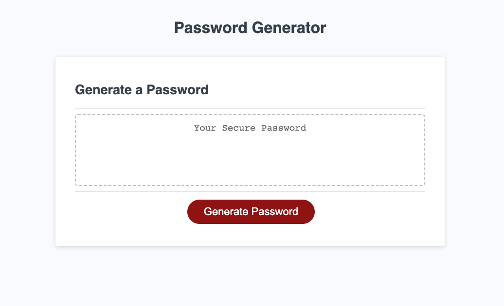

# Password Generator

## Description

This project was to create a password generator using Javascript. The goal was to give the user options to choose the length and character inclusions of their generated password. Anyone can use this to create a unique, customizable password for whatever they choose.

## Installation

No installation required. [Click here](https://julie-mac.github.io/password-generator/) to view the deployed webpage and create yourself a unique password!

## Usage

To use this Password Generator, first click "Generate Password", then the page will ask you how long you would like the password to be (between 8 and 128 characters, no more and no less!). Then, the page will ask you which characters you would like to include in your password. You can include lowercase letters, uppercase letters, numbers, and special characters. You have the option to not include some of these, but you must at least include one of these character sets.

## Credits

[julie-mac](https://github.com/julie-mac)

## License

Please refer to the LICENSE in the repository.

